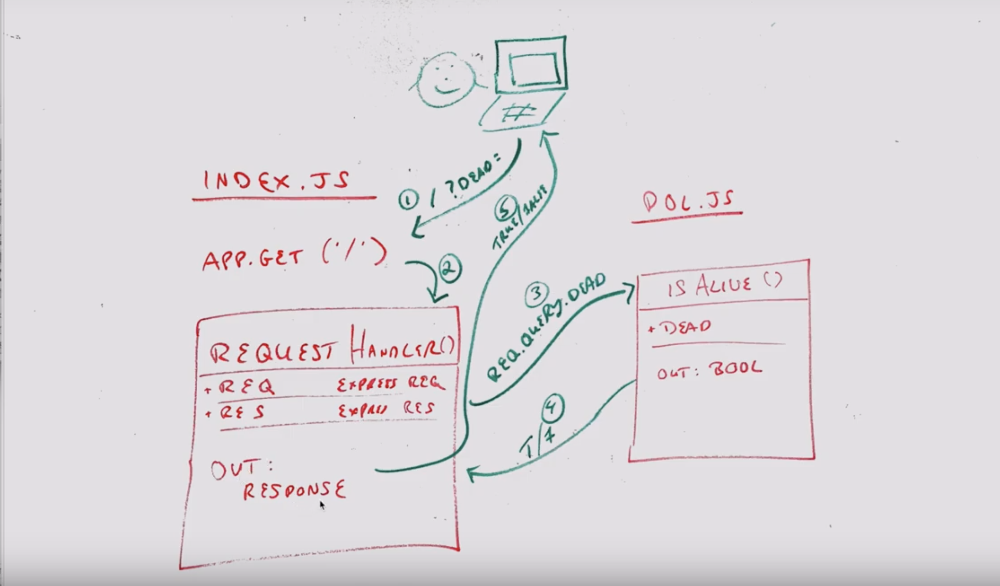

# LAB - 00

## Proof of Life Server

### Author: Joe Klause

### Links and Resources
* [submission PR](https://github.com/josephklause-401-advanced-javascript/lab-00/pull/1)
* [travis](https://travis-ci.com/josephklause-401-advanced-javascript/lab-00)
* [front-end](https://joseph-klause-lab-00.herokuapp.com/) (when applicable)

#### Documentation
* [jsdoc](https://joseph-klause-lab-00.herokuapp.com/docs) (Server assignments)

### Setup
#### `.env` requirements
* `PORT` - Port Number

#### Running the app
* 'npm start'
* Endpoint: '/'
    * Returns a boolean
* Endpoint: '/docs'
    * Returns  JSDoc Documentation Pages
    
  
#### Tests
* Unit Tests: 'npm test'
* Lint Tests: 'npm run lint'

#### UML

